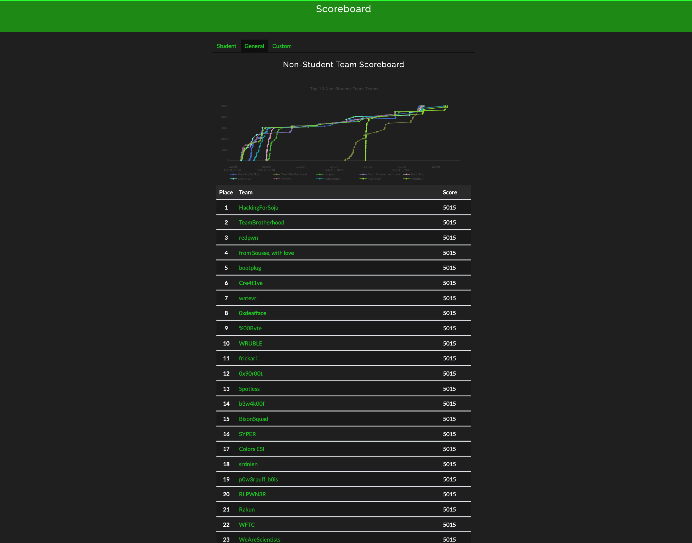

## NeverLAN CTF 2020

Each folder contains a `solution.txt` file with just the flag.

Most challenges have an accompanying `solution.py` or `solution.sh` solver script. Those should be run from within their respective directories.

## Scoreboard

[WFTC](https://ctftime.org/team/72059) position: 22nd

A much welcomed improvement from last year's results: 32nd

